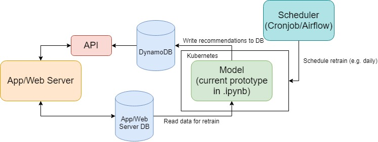

# Offsite-test

### Table of Contents
  * [Getting started](#getting-started)
  * [Q1 SQL](#q1-sql)
  * [Q2 Raw data analytics](#q2-Raw-data-analytics)
  * [Q3a Tagging prediction](#q3a-Tagging-prediction)
    + [Model performance](#model-performance)
    + [Hyper parameter tuning](#hyper-parameter-tuning)
    + [Model structure](#deploy-to-ecs)
  * [Q3b Recommender system](#q3b-recommender-system)
    + [System design](#system-design)
    + [Method](#method)
    + [Environment setup for prototype](#environment-setup-for-prototype)
    + [Production Concern](#production-concern)

### Getting started
Requirements:
- Python 3.8
- Docker & docker-compose

Navigate to the project directory and install the required packages:

`pip install -r requirements.txt`

The answers for each question are put into separate folders for clarity.

See below sections to find the respective programs for each question.


### Q1 SQL
**Docker and docker-compose are required.**

Navigate to the directory:

`offsite-test\Q1`

Docker compose a postgres container by running:

`docker-compose up --force-recreate`

**Make sure you do not have other postgres that is active and using port 5432**

Then run sql.py to display the query and result:
```
SQL query:

        WITH USER_WHO_INSTALLED_APP_ON_DATE AS ( 
            SELECT DISTINCT
                piwik_track.uid
            FROM
                piwik_track
            WHERE
                DATE(piwik_track.time) = to_date('2017-04-01', 'YYYY-MM-DD') 
                AND piwik_track.event_name = 'FIRST_INSTALL'
        ), USER_WHO_USED_APP_AT_LEAST_ONCE_IN_TIME_RANGE AS (
            SELECT DISTINCT
                piwik_track.uid
            FROM
                piwik_track
            WHERE
                piwik_track.time BETWEEN to_date('2017-04-02', 'YYYY-MM-DD') 
                AND to_date('2017-04-08', 'YYYY-MM-DD')
        )
        SELECT
            COUNT(uid)
        FROM
            USER_WHO_INSTALLED_APP_ON_DATE
        INNER JOIN
            USER_WHO_USED_APP_AT_LEAST_ONCE_IN_TIME_RANGE
        USING 
            (uid)
    
Table name: piwik_track
Number of dummy records: 10000
Number of dummy users: 1000
333

Process finished with exit code 0

```

### Q2 Raw data analytics
Simply run raw_data_analytics.py

### Q3a Tagging prediction
Navigate to directory Q3a and run:

`python tagging_prediction.py`

#### Model performance
The average accuracy on 5 stratified fold is 99.88%.
3 articles were mis-clasified during CV.


#### Hyper parameter tuning
To find the best parameters of the Random Forest Classifier and Count Vectorizer,
sklearn pipeline is used along with gridsearchCV to search for the best performing set of parameters.


#### Model structure
Texts are segmented into words (詞) instead of characters using pyCantonese. 
This step is crucial as the same set of Chinese characters in different order or combinations can mean different things.
The features are simply the document frequency of each word. Random Forest is chosen to be the classification model.

### Q3b Recommender system
The dataset is not provided in the repo due to its very large size.

In order to run the program, go [here](http://ocelma.net/MusicRecommendationDataset/lastfm-360K.html) and download the 360k users dataset. 

Extract the file `usersha1-artmbid-artname-plays.tsv` and `usersha1-profile.tsv` under the Q3b directory.

opens up your jupyter notebook by running the command:

`jupyter notebook`

navigate to directory `offsite-test/Q3b` and run the jupyter notebook `User-user Nearest Neighbours Prototype.ipynb`

#### System design


The recommender (or the model) will be dockerized and scheduled to run daily using a scheduler (e.g. cronjob, Apache Airflow).
The generated recommendations will be store into a database (here we use DynamoDB due to its super fast read and it's a key value DB).
The recommendations will then be available for the app/web server to fetch through an API endpoint (API endpoint will likely be a flask application).

#### Method
- Adopts user to user collaborative filtering.
- Uses user profile and normalised plays as features to find nearest neighbours.
- Get the top artists from nearest neighbours that are not yet listened by the user as recommendation.

#### Environment setup for prototype
install the packages in `requirements.txt`

#### Production Concern
1. **data volume growth**\
The more data the longer the model needs to compute, 
currently it is able to produce recommendations for all female users in around 30 minutes.
This will not be the case when the number of users increase and could possibly take a much longer time to compute once.
If the data volume grows to much, we can filter out data recorded long time ago (say, 5 years) and it is also possible to use other models,
such as FMs, and even deep models.
2. **new users**\
Currently new users are assumed to have the preference of the average of all users (global baseline approach).
But this might not work very well on these people, I'd suggest to use rule-based recommendation for new users depending on the performance (e.g. top artists in your country).
